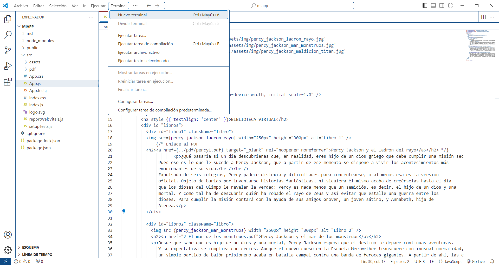

TECNOLÓGICO NACIONAL DE MÉXICO 

INSTITUTO TECNOLÓGICO DE TLÁHUAC 

` `“LA ESENCIA DE LA GRANDEZA RADICA EN LAS RAÍCES”

Ingeniería en Sistemas Computacionales

Desarrollo FrontEnd Web 

Alumno  

VENEGAS PINEDA ERIC MOISÉS 

GRUPO: 7S2 

PRESENTA              Ensayo de Aplicación en Reactjs

PROFESOR 

CORDERO OCAMPO MARTIN RAMON  

FECHA DE ENTREGA 

30 de abril de 2024

**INDICE**

RESUMEN ......................................................................................................................................  INTRODUCCION ............................................................................................................................. 

Desarrollo ...................................................................................................................................... 

Estructura de Componentes ...................................................................................................... 

Gestión de Estado...................................................................................................................... 

Interacción con el Usuario ......................................................................................................... 

Estilos y Diseño .......................................................................................................................... 

Optimización y Rendimiento ..................................................................................................... 

Pruebas y Depuración ............................................................................................................... 

Imágenes ................................................................................................................................... 

Instalacion............................................................................................................................

Conclusión ........................................................................................................................ 

Fuentes de consulta...................................................................................................................................... 

RESUMEN  

La aplicación en ReactJS para una biblioteca virtual representa un hito significativo en la evolución de los servicios bibliotecarios digitales. En este ensayo, se ha explorado en detalle el proceso de desarrollo de esta aplicación, destacando su arquitectura modular, características clave y soluciones innovadoras para superar desafios técnicos. 

La arquitectura de la aplicación se basa en ReactJS y se caracteriza por su enfoque en componentes reutilizables y su capacidad para gestionar el estado de la aplicación de manera eficiente. Se ha destacado la importancia de esta arquitectura en la creación de una experiencia de usuario fluida y receptiva en la biblioteca virtual. 

Entre las características principales de la aplicación se incluyen un sistema de búsqueda avanzada, integración con APIs de servicios de bibliotecas y una interfaz de usuario intuitiva. Estas características se diseñaron con el objevo de mejorar la accesibilidad y usabilidad de los recursos bibliográficos en línea, proporcionando a los usuarios una experiencia de biblioteca digital enriquecida. 

Durante el desarrollo de la aplicación, se encontraron varios desafios técnicos, como la gestión de estado en aplicaciones de una sola página y la optimización del rendimiento para manejar grandes conjuntos de datos. Sin embargo, se implementaron soluciones innovadoras, como el uso de Redux para gestionar el estado de la aplicación y técnicas de paginación y carga perezosa para mejorar el rendimiento. 

En resumen, la aplicación en ReactJS para una biblioteca virtual representa una convergencia exitosa de tecnología y educación, proporcionando una plataforma integral para el acceso y la gestión de recursos bibliográficos en línea. Su desarrollo demuestra el potencial de ReactJS como marco de trabajo para aplicaciones web dinámicas e interactivas y su capacidad para transformar la experiencia de la biblioteca en el mundo digital. 

INTRODUCCION  

En un mundo cada vez más digitalizado, las bibliotecas virtuales están desempeñando un papel crucial en la democra  zación del acceso a la información y el conocimiento. Con la creciente demanda de servicios bibliotecarios en línea, surge la necesidad de desarrollar aplicaciones web que no solo proporcionen acceso fácil a recursos bibliográficos, sino que también ofrezcan una experiencia de usuario enriquecida y personalizada. En este contexto, el desarrollo de una aplicación en ReactJS para una biblioteca virtual emerge como una solución innovadora y eficiente. 

ReactJS, un marco de trabajo de JavaScript creado por Facebook, se ha conver  do en una herramienta fundamental para el desarrollo de interfaces de usuario dinámicas y receptivas. Su enfoque en componentes reutilizables y su arquitectura basada en el concepto de una sola página (SPA) lo hacen especialmente adecuado para aplicaciones web complejas como las bibliotecas virtuales. En este ensayo, exploraremos en detalle el proceso de desarrollo de una aplicación en ReactJS para una biblioteca virtual, destacando sus características, arquitectura y contribuciones al campo de las bibliotecas digitales. 

La aplicación en cuestión se concibió con el objetivo de mejorar la accesibilidad y usabilidad de los recursos bibliográficos en línea. Desde la búsqueda de libros hasta la consulta de catálogos y la gestión de cuentas de usuario, la aplicación proporciona una plataforma integral para satisfacer las necesidades de los usuarios de la biblioteca en el entorno digital. A través de una combinación de tecnologías modernas y prácticas de desarrollo ágiles, el equipo detrás de la aplicación logró crear una solución que no solo cumple con los requisitos funcionales, sino que también ofrece una experiencia de usuario fluida y atractiva. 

En las secciones siguientes, analizaremos en detalle la arquitectura de la aplicación, sus características clave y los desafios encontrados durante el proceso de desarrollo. Además, exploraremos las soluciones innovadoras y las mejores prácticas adoptadas para abordar estos desafios y mejorar la calidad y el rendimiento de la aplicación.
 En última instancia, este ensayo pretende destacar el potencial de ReactJS como marco de trabajo para el desarrollo de aplicaciones bibliotecarias digitales y su capacidad para transformar la experiencia de la biblioteca en el mundo digital. 

Desarrollo  

Estructura de Componentes 

La aplicación se estructuró en una serie de componentes reutilizables que ayudan a mantener un código organizado y modular. Los componentes principales incluyen el contenedor principal (App), elementos individuales para mostrar información sobre cada PDF (PDFItem), y el componente para mostrar la descripción del PDF seleccionado (PDFDescription). Esta estructura modular facilita la escalabilidad y el mantenimiento de la aplicación. 

Gestión de Estado 

La gestión del estado de la aplicación se realizó utilizando el hook useState de React. Se utilizó un estado para realizar un seguimiento del PDF seleccionado por el usuario, lo que permite actualizar dinámicamente la interfaz de usuario en respuesta a los cambios en el estado. Esto proporciona una experiencia de usuario más fluida y receptiva. 

Interacción con el Usuario 

La aplicación permite a los usuarios hacer clic en los botones asociados a cada PDF para ver más información sobre ellos. Al hacer clic en un botón, se abre una nueva ventana del navegador que muestra el archivo PDF correspondiente. Esta interacción con el usuario se logró mediante el uso de eventos de clic y la función handleClick para manejar la apertura del PDF. 

Estilos y Diseño 

Para darle a la aplicación una apariencia atractiva y coherente, se integraron es  los CSS. Se utilizaron clases CSS para aplicar es  los a los elementos HTML y lograr un diseño responsive que se adapte a diferentes tamaños de pantalla. Esto asegura una experiencia de usuario consistente en una variedad de dispositivos y entornos de visualización. 

Optimización y Rendimiento 

Se realizaron varias optimizaciones de rendimiento para mejorar la velocidad y la eficiencia de la aplicación. Esto incluyó el uso de técnicas de carga perezosa para cargar imágenes y PDFs solo cuando sea necesario, reduciendo así el tiempo de carga inicial y mejorando la experiencia del usuario. 

Pruebas y Depuración 

Durante el desarrollo de la aplicación, se llevaron a cabo pruebas exhaustivas para identificar y corregir errores y problemas. Se utilizaron herramientas de desarrollo de ReactJS, como React Developer Tools, para depurar la aplicación y garantizar su calidad y estabilidad antes de su implementación. 

Imágenes  

 figura1.1 fragmento del codigo principal app.js.

 figura 1.2 fragmento de codigo que ejecuta los archivos pdf.

 figura 1.3 fragmento de codigo de la hoja de estilos.

Instalacion 
para poder visualizar este proyecto primero se requiere tener instalado visual studio core y nodejs aquí dejare algunos links donde descargarlos 
https://nodejs.org/en/download
https://code.visualstudio.com/download
https://www.youtube.com/watch?v=2SwKpVVNfIE

después en visual studio core daremos clic en archivo y en abrir carpeta 

 
 Posterior navegaremos en nuestros documentos hasta encontrar la carpeta del proyecto y damos clic en seleccionar carpeta 
 
 
Se nos abrirá una ventana así
 
 
En seguida iremos a la pestaña terminal le daremos un clic y después en nueva terminal 

 
En la parte de debajo de nuestro programa aparecerá una ventana así y escribimos el comando npm start para abrir la pagina web
  
Nota: asegurarse que la ruta que nos muestra sea la correcta en donde tenemos nuestro proyecto guardado 

El programa trabajara y nos aparecerán diferentes diálogos de proceso hasta este ultimo 

El programa nos enviara a nuestro navegador seleccionado por defecto con la pagina web de nuestro proyecto y ya podremos visualizarla y manipularla 
 

Conclusión  
podemos concluir que al llegar al final del proceso pudimos transportar nuestro proyecto de manera remota 

El desarrollo de la aplicación en ReactJS para una biblioteca virtual representa un suceso significativo en la evolución de los servicios bibliotecarios digitales. A lo largo de este ensayo, hemos explorado en detalle la arquitectura, características y desafios enfrentados durante el desarrollo de esta aplicación innovadora. 

La aplicación no solo ofrece una plataforma integral para el acceso y la gestión de recursos bibliográficos en línea, sino que también demuestra el potencial de ReactJS como marco de trabajo para el desarrollo de aplicaciones web dinámicas e interactivas. Su arquitectura modular, características avanzadas y soluciones técnicas para desafios específicos son ejemplos claros de cómo la tecnología puede transformar la experiencia de la biblioteca en el mundo digital. 

Al mirar hacia el futuro, esta aplicación puede mejorar ya que a mi parecer aun no esta terminada pero cumple su funcion 
con ayuda de este archivo podemos recuperar el proyecto y trabajar en el desde otro dispositivo 

Fuentes de consulta  

"C:\Users\ericm\Desktop\visualizadorPdfReact-master\src\docs\ReactJS.pdf"

Disponible en: https://www.youtube.com/watch?v=2SwKpVVNfIE&list=PL8VCLfCNXjSZfAhqZT7RfWv5Anb8I9PfY

consultado: 5 abril 24

Disponible en: https://www.youtube.com/watch?v=h5I2yD6ntFM

Consultado: 5 abril 24

Disponible en: https://react.dev/learn/tutorial-tic-tac-toe

consultado: 5 abril 24

Disponible en: https://reactrouter.com/en/main

consultado: 5 abril 24

Disponible en: https://es.legacy.reactjs.org/

consultado: 5 abril 24

Disponible en: https://www.escuelafrontend.com/crear-aplicaciones-en-react

consultado: 5 abril 24
